# Protein Bite

[Protein Bite live site](https://protein-bite-e6c19a894f37.herokuapp.com/)

Creating a protein-based website with a strong focus on recipes allows me to share a wide variety of high-protein meal ideas that cater to different tastes, dietary needs, and health goals. My goal is to provide users with an easy-to-navigate platform where they can explore nutritious and delicious recipes that make it simple to incorporate more protein into their daily meals. Whether someone is looking to build muscle, lose weight, or simply eat healthier, I want the site to be a go-to resource for inspiration and guidance. I expect users to leave the site feeling motivated and equipped with practical, tasty recipe options they can enjoy and benefit from.

## UX

### Design 

### Colour Scheme

I decided to go with a main colour of green, is commonly associated with nature, life, growth, and health. I did some research with what colour to combine with the green but also still stand out enough and I went with a cherry red colour. 

Green: #2a9461

Red: #ab1010

For the navigation bar, hero background and footer colour looked too plain with just a solid green colour, so i created a linear-gradient from the left to the right. 

linear-gradient: left to right, #10b981, #0d9488

## User Stories

1. User Story: Find High-Protein Recipes
As a user,
I want to search for high-protein recipes based on ingredients, meal type, or dietary preferences,
So that I can find meals that suit my needs and preferences.

I will complete this by having a variety of different recipes on the recipe page.

2. User Story: Create a Personalized Meal Plan
As a user,
I want to create a personalized meal plan based on my dietary goals and protein requirements,
So that I can ensure I’m meeting my protein targets throughout the week.

I will complete this by giving the user the option to create an account to view recipes. I will also add 'serves' onto the recipes so users can create meals in bulk.

3. User Story: easily Track Daily Protein Intake
As a user,
I want to track my daily protein intake and see how much protein I've consumed,
So that I can monitor my progress and stay on track with my nutrition goals.

I will complete this by making sure each recipe states how much protein is in each recipe.

4. User Story: Access Nutritional Information
As a user,
I want to view the nutritional breakdown of each recipe,
So that I can see the exact protein content, calories, carbs, fats, and other macronutrients.

I will complete this by adding in extra information about what's in each recipe.

5. User Story: Talk about Recipes with Others
As a user,
I want to talk about my favorite high-protein recipes with friends and other users,
So that I can inspire others to eat more protein-rich foods.

I will complete this by adding in a comment section where users will be able to talk with eachother about what they thought of the recipe and maybe any changes they made.

## Wireframes

### Home page

### About us page

### Recipes page

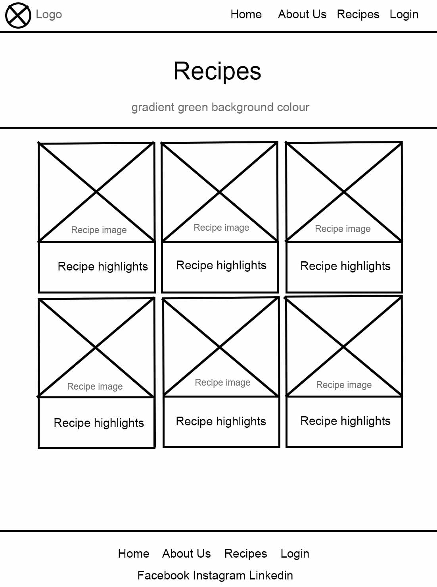

### Individual recipe page

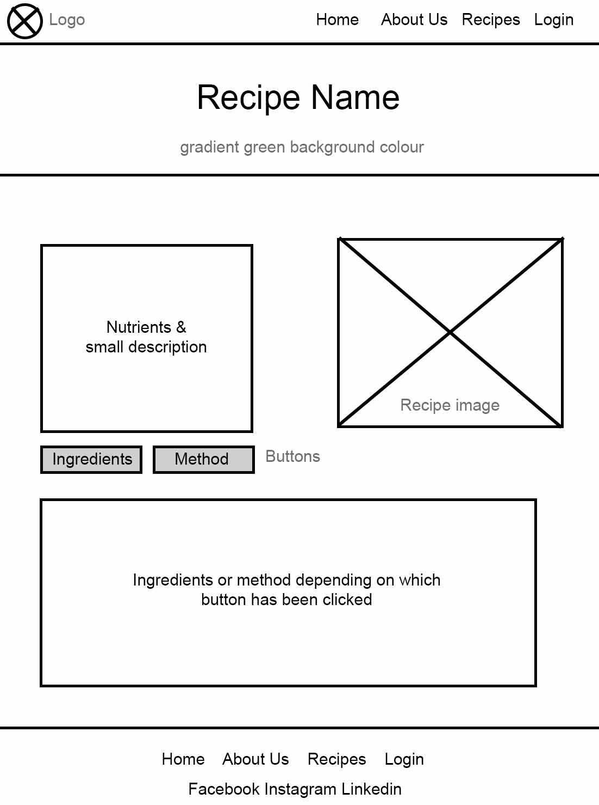

### Login

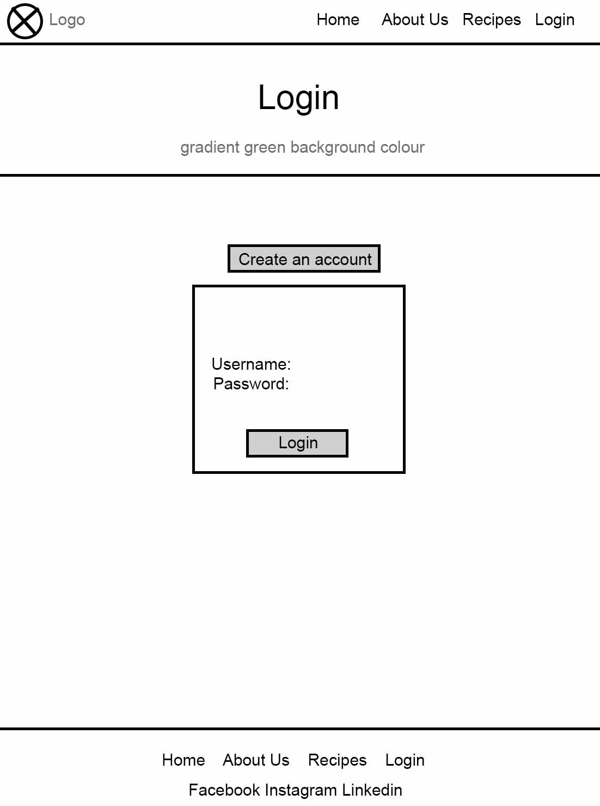

### Create account

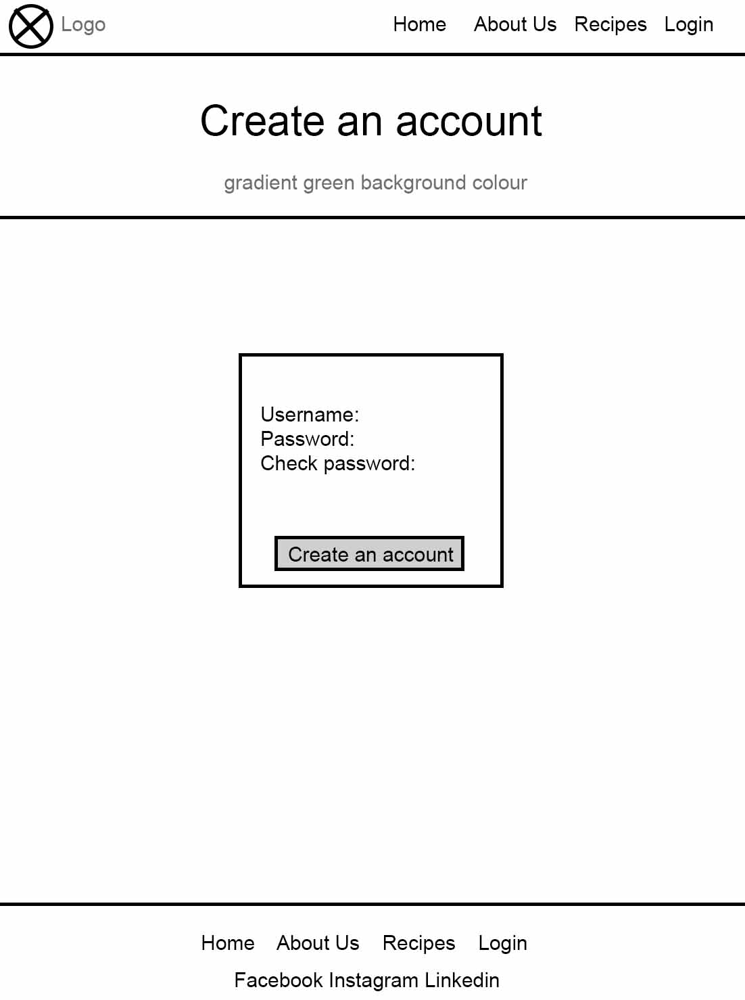

## Features

### Site Pages

Below are the screenshots of all the pages and a brief description of the reason the page is important. 

#### Home

The home page is the first page users will see when coming to the website. It talks a little about the benefits of a high protein diet and hopefully some of the benefits is why the user is looking at the site in the first place and will encourage them to click on more pages, create an account and continue to use the site. 

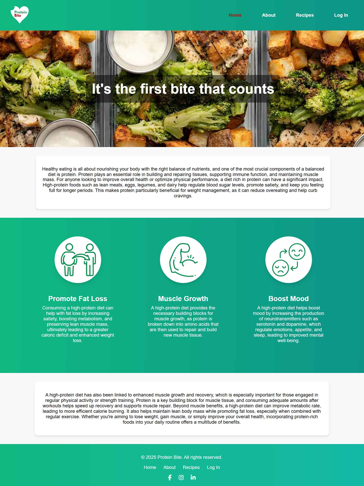

#### About Us

This a personal approach to why the site was started; from research of other similar sites they all talk about the journey and made it quite personal. This has seemed to have a positive effect and people seem to feel more connected with the chef/ site owner. 

#### Recipes

This is the main page for the website, where people can view all the different recipes available and click on any of the cards to find out more information and what they need to be able to create it at home. 

When an image doesn't load or get uploaded, I have created a default image with the logo and text saying "Picuture coming soon"; this is to make sure the website doesn't have any blank areas.

#### Individual Recipe

Once the user clicks on an individual recipe that they like, it'll take you to a page like the one below. This page is to show everything you need to know about eahc recipe and how to create it. At the bottom there is a comment section, the user would need to be signed in to be able to leave comments.

The comment section is important so users can talk with each other and explain what they thought about the recipe, or maybe any changes that made it better. It means the users could also talk with the owner of the site and have a connection, again to encourage more site usage. 

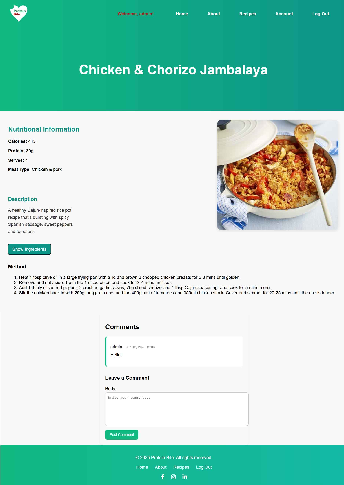

#### Sign Up

Here's the page the user can sign up for an account. This is so they will be able to comment on any of the recipes on the site. 

The future of the account would be that users could add favourite recipes to their account and have exclusive access to any new and upcoming recipes being created. 

If the email is already in use it won't allow you to sign up.

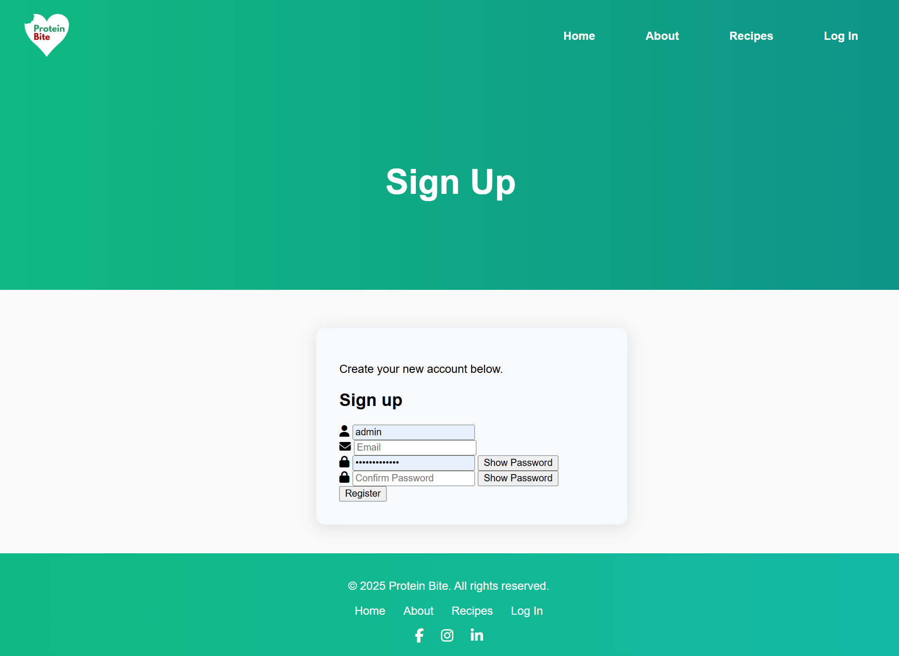

#### Log In

This is the page for all users to go to when they want to access their account. If they have already made an account they come here to sign in. 

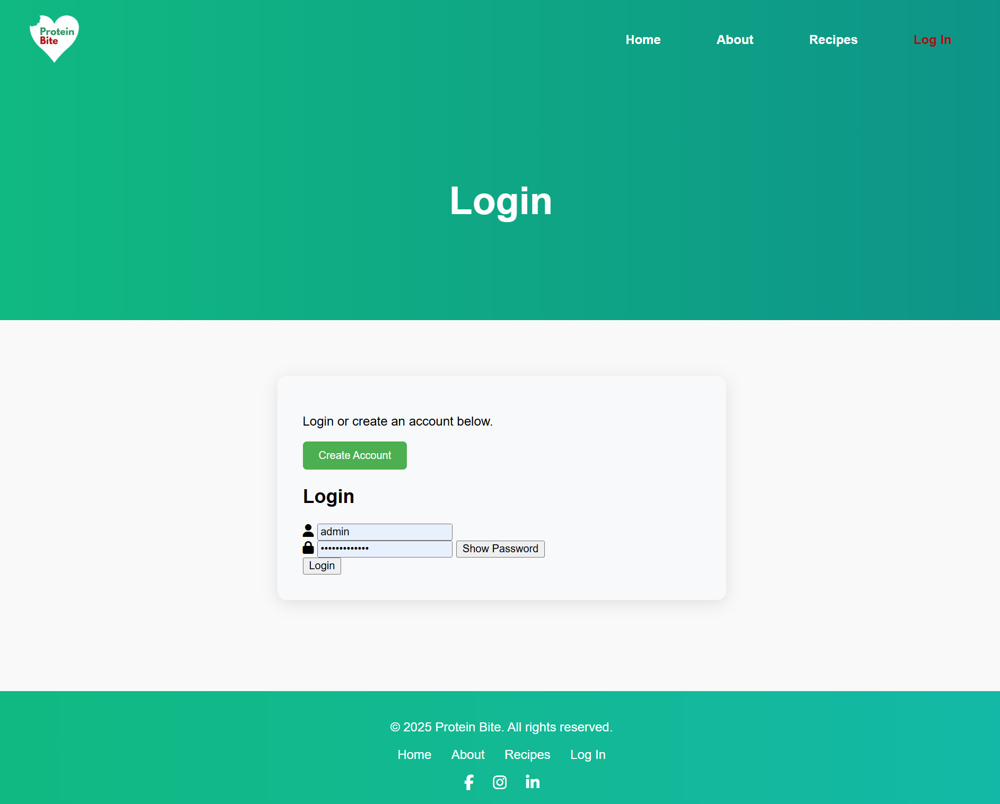

#### Account

This is the users account page with their personal details. They can add more details like phone number and address, they can also change this later on. You cannot change the email or username, as this must stay the same. This is also area the user can delete their account off the system.

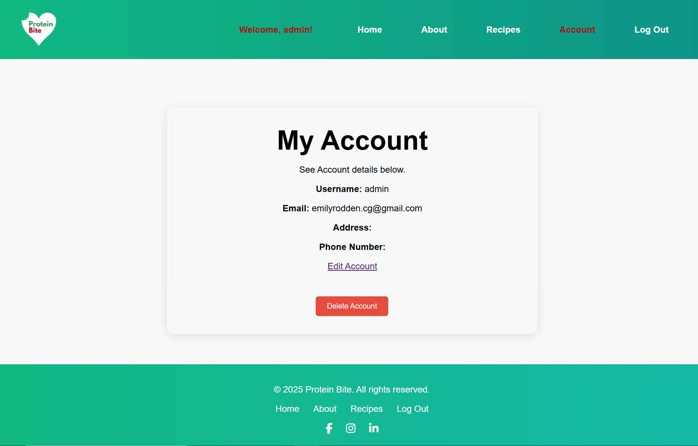

#### Edit Account

As talked about above, this is where the user would edit the details show on the site.

### User Features

- Users can register for an account using the log in form. This creates a user database and automatically secures the user's sensitive information.
- Users who have made an account can easily log in to their account to access their personal details, make changes and add comments to the recipe pages.
- User can update their profile but adding a phone number and/or address.
- Users who are logged in can easily log out in order to stop access to their account.
- Users can comment on recipes, and talk with other users that comment.
- There is a welcome message on the nav bar when the user is signed in.
- There's a delete button on the account page, where users can delete their account if they don't want it anymore.

### Future Features

When thinking about the future development of my protein-based website, I have several feature designs and improvements in mind to enhance user experience and make the platform more interactive, personalized, and functional. One of the key updates I plan to implement is a recipe filtering system on the recipe page. This feature would allow users to sort and filter recipes based on specific ingredients, cooking duration, and serving size. For example, someone could quickly find recipes that include chicken, take under 30 minutes to prepare, and serve two people—saving time and making meal planning much easier.

In addition to filtering, I’d like to introduce a “Favourites” section, where users can save their most-loved recipes to revisit later. This would require user accounts or cookies to track preferences, and would be especially helpful for regular visitors who want to build a personalized collection of go-to meals without needing to search each time.

Another exciting feature I’d like to launch is a monthly newsletter. Subscribers would receive exclusive recipes, top protein tips, and seasonal meal ideas straight to their inbox. This not only keeps users engaged with the site but also builds a community around shared goals of healthy eating and nutrition. Over time, the newsletter could also include guest contributions, user-submitted recipes, and updates on new features or improvements on the site.

Altogether, these features aim to make the website not just a static recipe hub, but an evolving, user-friendly platform that supports healthy living through convenience, customization, and community engagement.

## Tools & Technologies Used

- [HTML](https://en.wikipedia.org/wiki/HTML) used for the main site content.
- [CSS](https://en.wikipedia.org/wiki/CSS) used for the main site design and layout.
- [JavaScript](https://www.javascript.com/) used for user interaction on the site.
- [Python](https://www.python.org/) used as the back-end programming language.
- [Git](https://git-scm.com/) used for version control. (git add, git commit, git push)
- [GitHub](https://github.com/) used for secure online code storage.
- [Gitpod](https://www.gitpod.io/) used as a cloud-based IDE for development.
- [Django](https://www.djangoproject.com/) used as the Python framework for the site.
- [Heroku](https://www.heroku.com/) used for hosting the deployed site.
- [Cloudinary](https://cloudinary.com/) used for online static file storage. I was unable to get this to work with my account, but I have tried to include it.

## Development Process

The live deployed application can be found deployed on [Heroku.](https://protein-bite-e6c19a894f37.herokuapp.com/)

### Testing

Please see [testing file.](TESTING.md)

I have also done manual testing bu clicking on all links and pages on multiple different browsers. Screenshots have been provided in the testing file. I've also created a test account to make sure all the forms work with creating, managing and deleting user accounts.

The screenshots below show when a user tried to create an account when a different user already has that username. The other screenshot is the extra warning that comes up when the suer tried to delete their account.

### Deployment

- The live deployed application can be found deployed on [Heroku.](https://protein-bite-e6c19a894f37.herokuapp.com/)

- This project uses Heroku, a Platform-as-a-Service (PaaS) that allows developers to build, run, and manage applications entirely in the cloud.

- Follow these steps to deploy your app after setting up your account:

- In the top-right corner of your Heroku Dashboard, click on New, then select Create new app from the dropdown menu.

- Choose a unique name for your app, select a region (either EU or USA), and click Create App.

- Once your app is created, go to the Settings tab, click on Reveal Config Vars, and set your environment variables.

- Heroku requires two files to deploy your app correctly:

requirements.txt

Procfile

To install the necessary dependencies, run:

pip3 install -r requirements.txt
- If you have additional packages installed, update the requirements.txt file with:

pip3 freeze --local > requirements.txt
- To create the Procfile, use the following command:

echo web: gunicorn app_name.wsgi > Procfile
- Replace app_name with the name of your main Django app (the folder containing settings.py).

- Connecting Your GitHub Repository and Deploying:
Option 1:

- Go to the Deploy tab of your Heroku app and select Automatic Deployment.

- Option 2:

- In your terminal, log in to Heroku with the following command:

heroku login -i
- Set the Heroku remote repository:

heroku git:remote -a app_name
(Make sure to replace app_name with the actual name of your app.)

- Perform the standard Git commands (git add, git commit, and git push), and finally, push your changes to Heroku with:

git push heroku main
- Your project should now be connected and deployed on Heroku!

### Back End

In the backend of the website using Django Admin, I have added extra formats for the superuser to be able to add recipes with all the relevent details and manage all comments that get added to the website; including to delete any they don't want. They can also check and edit any users.

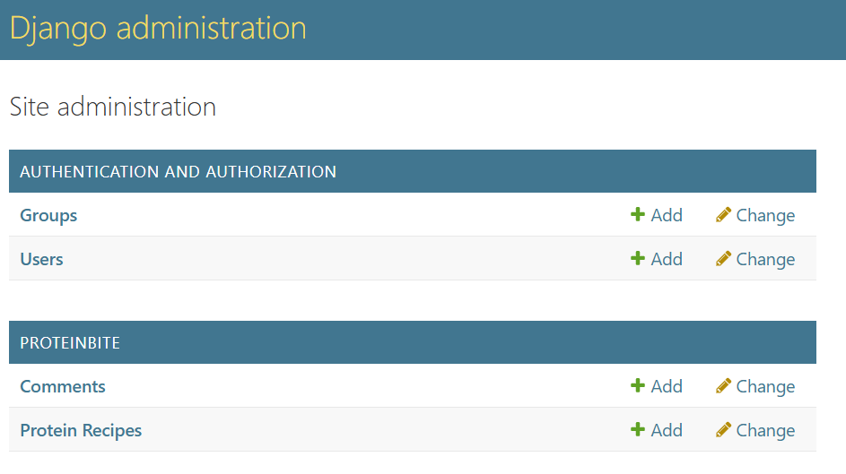

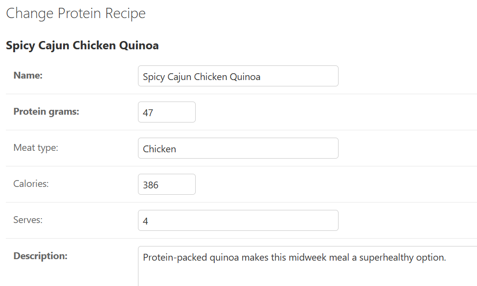

## Credits

### Canva

I created the below icons, Protein Bite logo and the recipes picture coming soon designs in [Canva](https://www.canva.com/).

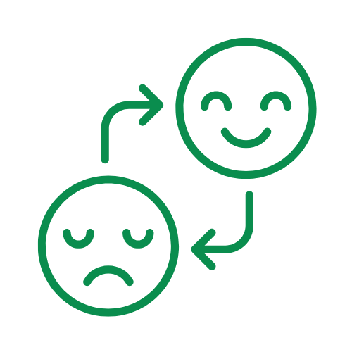

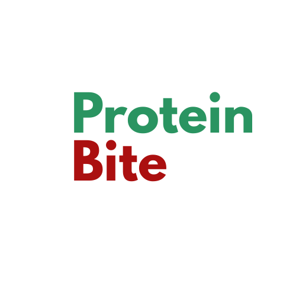
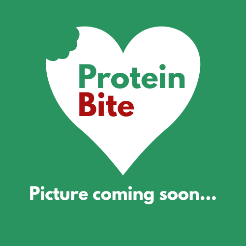

### Adobe Photoshop

I used [Adobe Photoshop](https://www.adobe.com/products/photoshop.html?georouting=off&analytics=off&martech=off) to create all the wireframes.

### Recipes

I used [BBCGoodFood](https://www.bbcgoodfood.com/) for my recipes, I found high protein recipes, with a variety of different ingredients for my website. Below are all the websites/ recipes i've used and the images for the recipes came from those sites too.

[chicken and chorizo jambalaya](https://www.bbcgoodfood.com/recipes/chicken-chorizo-jambalaya)

[Salmon](https://www.bbcgoodfood.com/recipes/salmon-egg-fried-rice?mvt=i&mvn=a68f89eedb78498abd131461d43092c9&mvp=NA-BBCGCOM-11240463&mvl=Fn-Native%20Collection%20%5BNative%20Collection%20Page%20%2F%20Search%20Guide%5D)

[Chicken Stroganoff](https://www.bbcgoodfood.com/recipes/chicken-stroganoff)

[Crispy chilli turkey noodles](https://www.bbcgoodfood.com/recipes/crispy-chilli-turkey-noodles)

[Spicy Cajun chicken quinoa](https://www.bbcgoodfood.com/recipes/spicy-cajun-chicken-quinoa)

[Easy lamb tagine](https://www.bbcgoodfood.com/recipes/fruity-lamb-tagine)

[Oven-baked pork chops](https://www.bbcgoodfood.com/recipes/oven-baked-pork-chops) 

### Icons
I used online social media Icons for the footer. I used Facebook, Instagram, Linkedin.

### Images

Home page hero image - https://www.budgetbytes.com/ranch-chicken-meal-prep/
I also used a personal image for the about us page.

### ChatGPT

I had some errors during the build stage and I was unsure what they meant, I tried to get help from student care but he wasn't able to help. I copied the errors into ChatGPT to find out what they were and then I worked out how to fix them. Below are the errors I had.

### Research

Below are sites I visited that are similar to what I wanted to created, these are where I got some ideas from.

- [Becky excel](https://glutenfreecuppatea.co.uk/)
- [Food for Fitness](https://www.foodforfitness.co.uk/high-protein-recipes/)
- [The Good Bite](https://www.thegoodbite.co.uk/)
- [tamingtwins](https://www.tamingtwins.com/category/recipes/main-courses/vegetarian/)

### Acknowledgements

To help me during this project I used Code Institute videos and tutors with any issues I hade. I also watched videos online and used AI to try and help explain some of the errors I got during the build stages. 

- [Code Institute](https://codeinstitute.net/?utm_term=code%20institute&utm_campaign=CI%20-%20UK%20-%20Search%20-%20Brand&utm_source=adwords&utm_medium=ppc&hsa_acc=8983321581&hsa_cam=1578649861&hsa_grp=62188641240&hsa_ad=635720257674&hsa_src=g&hsa_tgt=kwd-319867646331&hsa_kw=code%20institute&hsa_mt=e&hsa_net=adwords&hsa_ver=3&gad_source=1&gad_campaignid=1578649861&gbraid=0AAAAADnKut-JuweBk3dFRyAVvSfOVsTqm&gclid=Cj0KCQjwrPHABhCIARIsAFW2XBPx2xkr9-nDjql_dxWlb0TlYHAEOOMB-qwE9vAKOwaPl8JRfIhZo-MaAmuYEALw_wcB)
- [Django Youtube Video](https://www.youtube.com/watch?v=0sMtoedWaf0)
- [Django setup](https://www.youtube.com/watch?v=f1NQnhFFV-E)
- [ChatGPT](https://chatgpt.com/)

