Protein Bite testing screenshots

## HTML
I have used the recommended [HTML W3C Validator](https://validator.w3.org/) to validate all of my HTML files.

| Page | Screenshot | Notes |
| ---- | ---------- | ----- | 
| Home | 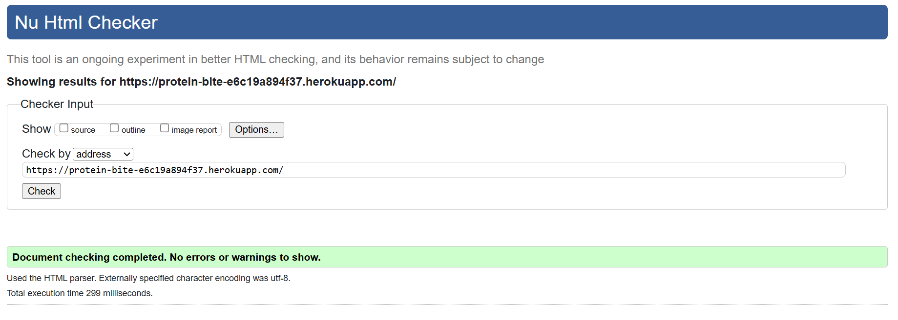 | Pass - No Errors |
| About | 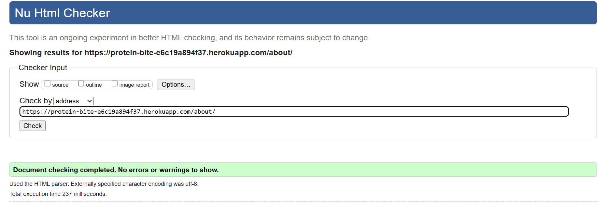 | Pass - No Errors |
| Account |  | HTTP resource not retrievable Error |
| login | 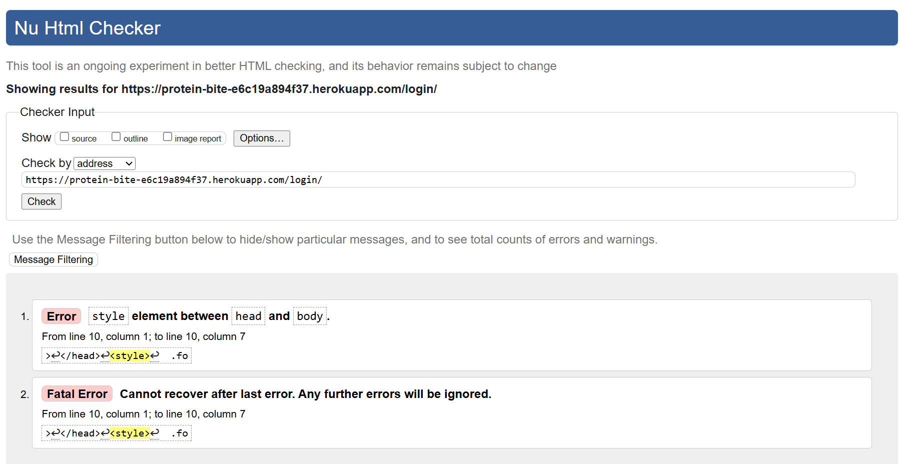 | Style coding was in the wrong area Error |
| login | 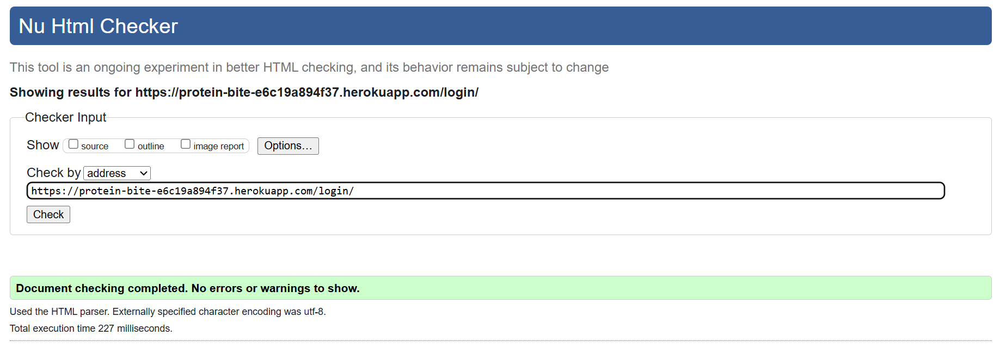 | Fixed error- Pass - No Errors |
| Recipe | 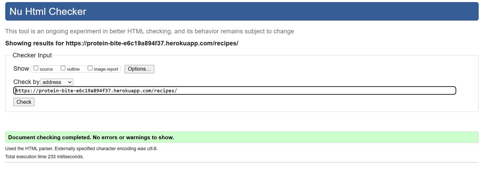 | Pass - No Errors |
| Recipe 1 | 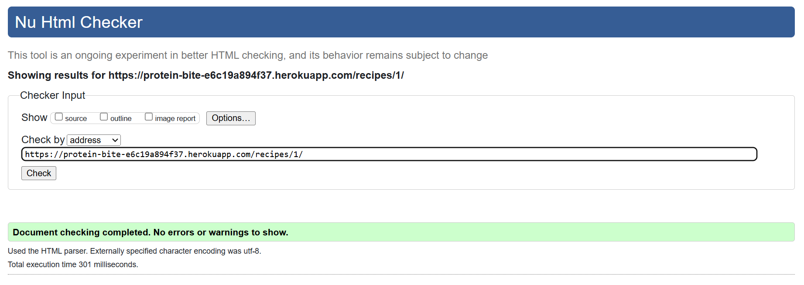 | Pass - No Errors |
| Recipe 2 | 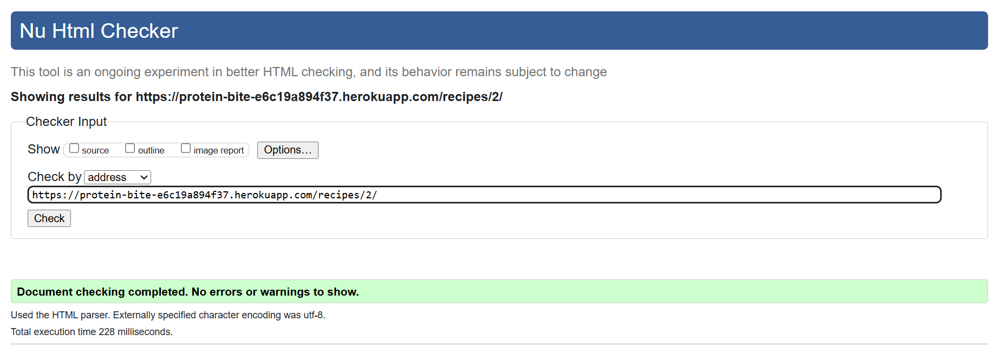 | Pass - No Errors |
| Recipe 3 | 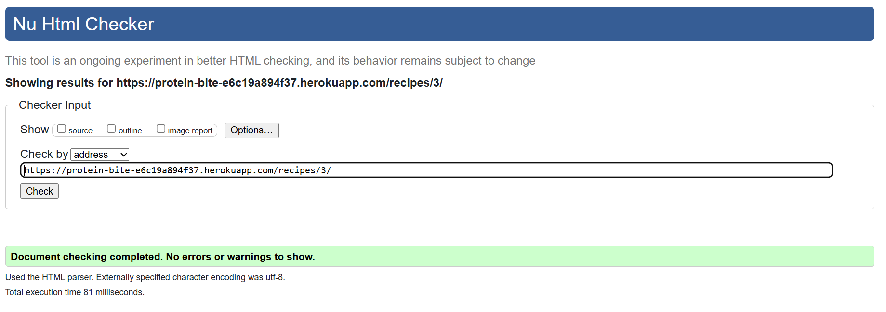 | Pass - No Errors |
| Recipe 4 | 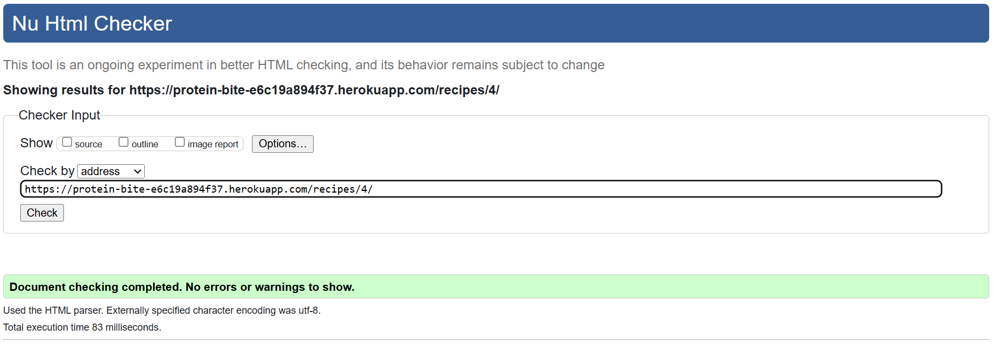 | Pass - No Errors |
| Recipe 5 | 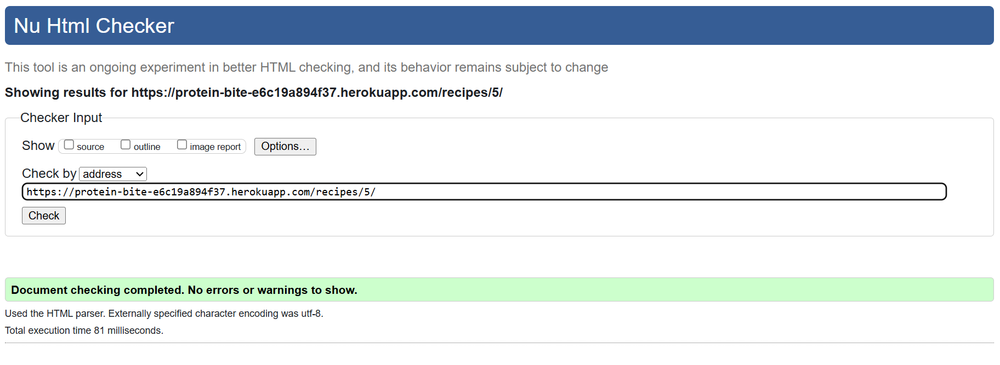 | Pass - No Errors |
| Recipe 6 | 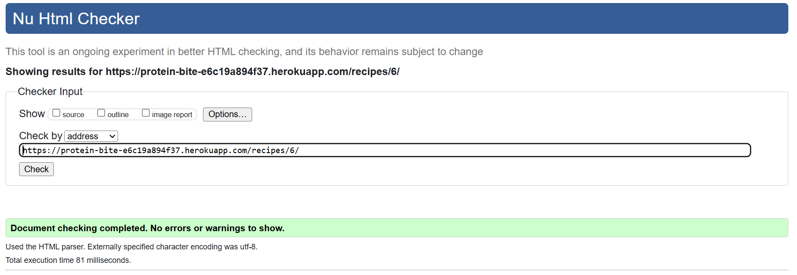 | Pass - No Errors |
| Recipe 7 |  | Pass - No Errors |

## CSS
I have used the recommended [CSS Jigsaw Validator](https://jigsaw.w3.org/css-validator/) to validate all of my CSS files.

| Page | Screenshot | Notes |
| ---- | ---------- | ----- |
| Screenshot | 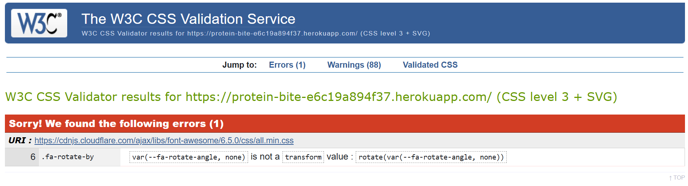 | Pass - No Errors |