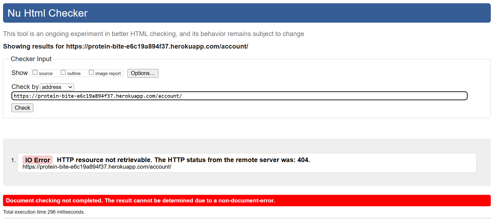

Protein Bite testing screenshots

## HTML
I have used the recommended [HTML W3C Validator](https://validator.w3.org/) to validate all of my HTML files.

| Page | Screenshot | Notes |
| ---- | ---------- | ----- | 
| Home |  | Pass - No Errors |
| About |  | Pass - No Errors |
| Account |  | HTTP resource not retrievable Error |
| login |  | Style coding was in the wrong area Error |
| login |  | Fixed error- Pass - No Errors |
| Recipe |  | Pass - No Errors |
| Recipe 1 |  | Pass - No Errors |
| Recipe 2 |  | Pass - No Errors |
| Recipe 3 |  | Pass - No Errors |
| Recipe 4 |  | Pass - No Errors |
| Recipe 5 |  | Pass - No Errors |
| Recipe 6 |  | Pass - No Errors |
| Recipe 7 |  | Pass - No Errors |

## CSS
I have used the recommended [CSS Jigsaw Validator](https://jigsaw.w3.org/css-validator/) to validate all of my CSS files.

| File | Screenshot | Notes |
| ---- | ---------- | ----- |
| CSS Screenshot |  | This error is from the enivorment I installed, I have tried to search for it but can't find the line of code. The warnings are also extensions |

## Python
I have used the [PEP8 CI Python Linter](https://pep8ci.herokuapp.com/) to validate my Python files.

| Page | Screenshot | Notes |
| ---- | ---------- | ----- |
| admin |  | one line too long |
| apps |  | pass - No Errors |
| asgi |  | pass - No Errors |
| forms |  | pass - No Errors |
| init |  | pass - No Errors |
| manage |  | pass - No Errors |
| models |  | pass - No Errors |
| settings |  | lines too long |
| urls |  | lines too long |
| views |  | expected 2 blank lines, no space in the comment, whitespace, code in the wrong area |
| views |  | fixed errors: pass - No Errors |